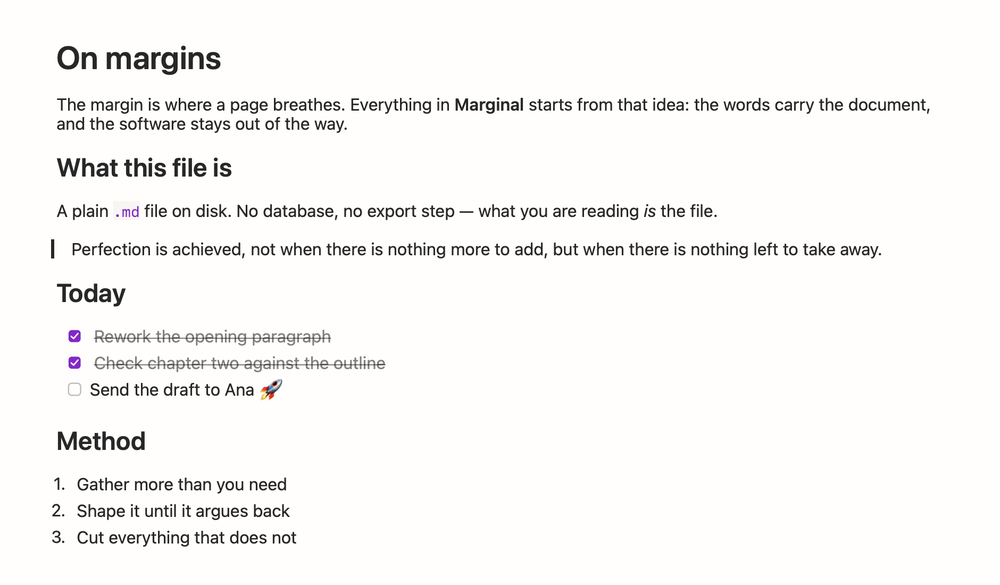

<p align="center">
  
</p>

<h1 align="center">Marginal</h1>

<p align="center"><em>Markdown that reads the way it renders.</em></p>

<p align="center">
  A native, lightweight markdown editor and beautiful viewer for macOS.
</p>

---

Open a `.md` file, write, and see it rendered beautifully as you type — bold, italic, headers, links, tables, code blocks, and images all render inline, with markdown syntax revealing itself only where your cursor is. No projects, no folders, no sidebar. Good at one job: being your default markdown editor.

<picture>
  <source media="(prefers-color-scheme: dark)" srcset="marketing/site/screenshot-main-dark.png">
  
</picture>

> **Status: 🚧 Phase 2 complete (formatting engine: inline code, fenced code blocks with basic highlighting, blockquotes, horizontal rules).** Tables, images, AI, visual polish, and export are not yet implemented — see [`specs`](specs) and [`plans`](plans).

## Why

Existing options are either too heavy (Electron-based editors), too raw (syntax-highlighted plain text editors), or come with project/notes management you didn't ask for. Marginal aims to do exactly one thing well: open a markdown file and let you write and read it beautifully, fast, natively.

## Planned features

- Live WYSIWYG editing with reveal-on-cursor markdown syntax (bold, italic, strikethrough, underline, headers, links)
- Live editable table grid
- Inline images (paste/drag-and-drop supported)
- Code blocks with basic syntax highlighting
- `View ▸ Show Source` raw markdown toggle, plus `⌘⌥C` to copy raw markdown from any selection
- Native macOS tabs and windows, autosave, Versions, Open Recent
- Light and dark modes designed to Apple's Human Interface Guidelines
- Adjustable font size (`⌘+`/`⌘-`) and font family (sans/serif/mono)
- Optional AI writing assistant using your own API key (BYOK) — rewrite, critique, or "roast" your writing
- Registers as a handler for `.md` / `.markdown` files

## Design

Marginal's look is a documented system, not a theme — paper surfaces, warm ink, a single
violet accent, system type at weights 400/500/600 (never 700), and heading sizes that
follow the app's own 1.25/1.5/1.875 scale.

- **[Design system](marketing/Marginal%20Design%20System/readme.md)** — tokens
  (color, type, spacing, radii, elevation, motion), components, and brand-voice
  guidelines. The app's `DesignPalette.swift` mirrors this token sheet.
- **[Typography specimen](marketing/Marginal%20Typography.html)** — the full type
  ramp and markdown rendering rules, as a self-contained page.
- **[Landing page](marketing/site/index.html)** — a one-page site built on the same
  tokens, with product shots rendered by the app's real text engine in both light and
  dark. Deployed with GitHub Pages via
  [`.github/workflows/deploy-site.yml`](.github/workflows/deploy-site.yml): enable it
  once under *Settings → Pages → Source: GitHub Actions*, and the site publishes to
  `https://jberends.github.io/marginal/` on every push that touches `marketing/site/`.
- **[App icon](assets/icon/)** — the long-tail serif "m" mark and its
  [design sheet](assets/icon/marginal-icon-design-system.png).

## Requirements

- macOS 14 (Sonoma) or later

## Building from source

```bash
brew install xcodegen
xcodegen generate
open Marginal.xcodeproj   # then ⌘R
```

or from the terminal:

```bash
xcodebuild -project Marginal.xcodeproj -scheme Marginal -configuration Release build
```

Tests: `xcodebuild -project Marginal.xcodeproj -scheme Marginal test`

Thinking about the Mac App Store? See the
[submission guide](marketing/app-store-submission.md).

## Contributing

Contributions are welcome once the initial implementation lands. See [CONTRIBUTING.md](CONTRIBUTING.md) and [CODE_OF_CONDUCT.md](CODE_OF_CONDUCT.md).

## Support the project

Marginal is free and always will be. If you'd like to support development, donation links will be added here once the project website is live.

## License

Licensed under the [Apache License 2.0](LICENSE).
