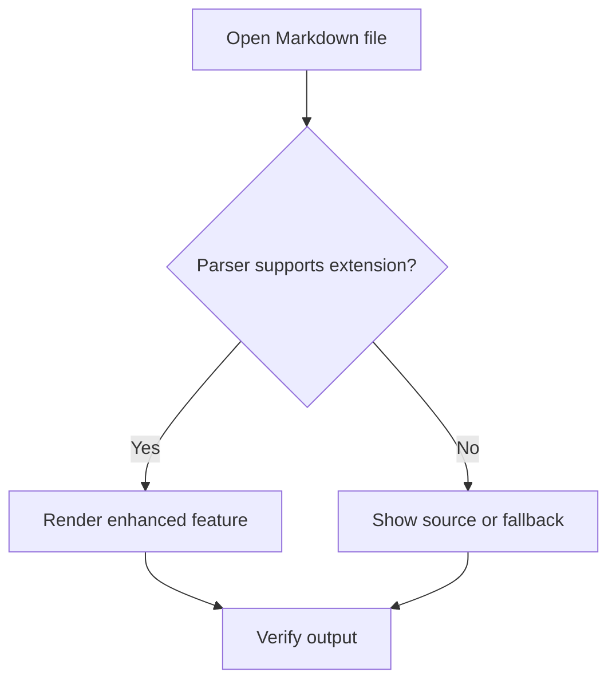
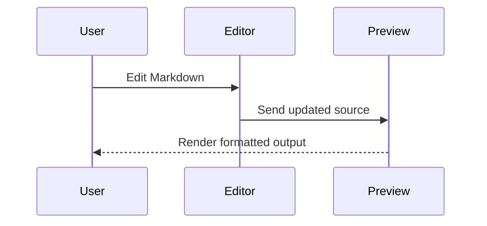
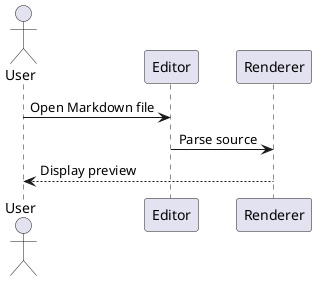

# Markdown Editor Feature Test Suite

> **Purpose:** This file is designed to test the features commonly expected in a modern Markdown editor.
>
> It includes standard Markdown syntax, popular extensions, editor-specific features, rendering edge cases, and an explicit feature checklist.

---

## Explicit Feature List

This file tests the following features:

1. Document headings from level 1 through level 6
2. Paragraphs and line wrapping
3. Forced line breaks0:00:00.297 INFO   :       Logged into <pyke Scope 'WCR-Full-trailer-2026-08-07-09:31:48' id c71df937>.
0:00:00.388 INFO   :          Loading English translation mapping table for trailers.
0:00:03.851 INFO   :       Retrieved support project: Support.
0:00:04.241 INFO   :        Adding request part "REQ-0579" in Support scope.
Traceback (most recent call last):
  File "/kecrunch/manage.py", line 93, in <module>
    sys.exit(manage())
             ^^^^^^^^
  File "/usr/local/lib/python3.12/site-packages/click/core.py", line 1524, in __call__
    return self.main(*args, **kwargs)
           ^^^^^^^^^^^^^^^^^^^^^^^^^^
  File "/usr/local/lib/python3.12/site-packages/click/core.py", line 1445, in main
    rv = self.invoke(ctx)
         ^^^^^^^^^^^^^^^^
  File "/usr/local/lib/python3.12/site-packages/click/core.py", line 1308, in invoke
    return ctx.invoke(self.callback, **ctx.params)
           ^^^^^^^^^^^^^^^^^^^^^^^^^^^^^^^^^^^^^^^
  File "/usr/local/lib/python3.12/site-packages/click/core.py", line 877, in invoke
    return callback(*args, **kwargs)
           ^^^^^^^^^^^^^^^^^^^^^^^^^
  File "/usr/local/lib/python3.12/site-packages/click/decorators.py", line 34, in new_func
    return f(get_current_context(), *args, **kwargs)
           ^^^^^^^^^^^^^^^^^^^^^^^^^^^^^^^^^^^^^^^^^
  File "/kecrunch/manage.py", line 89, in manage
    return run_app_entry_point()
           ^^^^^^^^^^^^^^^^^^^^^
  File "/workspace/src/services/generic/request_support.py", line 215, in main
    email_msg.send_email()
  File "/workspace/src/core/support_module/models/email.py", line 110, in send_email
    server = smtplib.SMTP(SMTP_INFO['SERVER'], SMTP_INFO['PORT'])
             ^^^^^^^^^^^^^^^^^^^^^^^^^^^^^^^^^^^^^^^^^^^^^^^^^^^^
  File "/usr/local/lib/python3.12/smtplib.py", line 255, in __init__
    (code, msg) = self.connect(host, port)
                  ^^^^^^^^^^^^^^^^^^^^^^^^
  File "/usr/local/lib/python3.12/smtplib.py", line 341, in connect
    self.sock = self._get_socket(host, port, self.timeout)
                ^^^^^^^^^^^^^^^^^^^^^^^^^^^^^^^^^^^^^^^^^^
  File "/usr/local/lib/python3.12/smtplib.py", line 312, in _get_socket
    return socket.create_connection((host, port), timeout,
           ^^^^^^^^^^^^^^^^^^^^^^^^^^^^^^^^^^^^^^^^^^^^^^^
  File "/usr/local/lib/python3.12/socket.py", line 865, in create_connection
    raise exceptions[0]
  File "/usr/local/lib/python3.12/socket.py", line 850, in create_connection
    sock.connect(sa)
TimeoutError: [Errno 110] Connection timed out

4. Horizontal rules
5. Bold text
6. Italic text
7. Bold and italic text combined
8. Strikethrough text
9. Underlined text using HTML
10. Highlighted text using HTML
11. Superscript using HTML
12. Subscript using HTML
13. Inline code
14. Escaped Markdown characters
15. HTML entities
16. Unordered lists
17. Ordered lists
18. Nested lists
19. Mixed ordered and unordered lists
20. Task lists
21. Blockquotes
22. Nested blockquotes
23. Inline links
24. Reference-style links
25. Automatic links
26. Email links
27. Images
28. Linked images
29. Image titles
30. Image alt text
31. Inline code blocks
32. Fenced code blocks
33. Syntax-highlighted code blocks
34. Code blocks containing Markdown syntax
35. Tables
36. Table alignment
37. Escaped pipe characters inside tables
38. Footnotes
39. Definition lists
40. Abbreviations
41. Heading IDs
42. Internal anchor links
43. Emoji shortcodes
44. Unicode emoji
45. Mathematical notation
46. LaTeX-style inline math
47. LaTeX-style display math
48. Mermaid diagrams
49. PlantUML-style diagram blocks
50. Admonitions or callouts
51. Collapsible sections using HTML
52. Raw inline HTML
53. Raw HTML blocks
54. Keyboard key notation
55. Marked or inserted text
56. Deleted text
57. Comments hidden in rendered output
58. Front matter
59. Metadata-like content
60. Hard tabs and indentation behavior
61. Long lines and horizontal scrolling
62. Unicode and multilingual text
63. Right-to-left text
64. Special punctuation
65. URLs containing query parameters
66. Relative links
67. File links
68. Nested formatting
69. Formatting adjacent to punctuation
70. Empty list items
71. Deeply nested content
72. Consecutive blank lines
73. Trailing whitespace
74. Backslash escapes
75. Character entity rendering
76. Typographic substitutions
77. Automatic table of contents compatibility
78. Print and export rendering
79. Source/rendered preview synchronization
80. Cursor and selection behavior around syntax
81. Find and replace compatibility
82. Spell-check behavior
83. Copy and paste behavior
84. Undo and redo behavior
85. Drag-and-drop image handling
86. Markdown linting compatibility
87. CommonMark compatibility
88. GitHub Flavored Markdown compatibility
89. MultiMarkdown compatibility
90. Editor-specific extension fallback behavior

---

## Front Matter

The block below is displayed as text because a document can normally have only one front matter block at its beginning.

```yaml
---
title: Markdown Editor Feature Test Suite
author: Example Author
date: 2026-07-24
tags:
  - markdown
  - editor
  - testing
draft: false
---
```

---

# Heading Level 1

## Heading Level 2

### Heading Level 3

#### Heading Level 4

##### Heading Level 5

###### Heading Level 6

Alternative heading level 1
===========================

Alternative heading level 2
---------------------------

---

## Paragraphs and Line Breaks

This is a normal paragraph. It contains enough text to test visual line wrapping, margin width, text selection, and reflow behavior. A Markdown editor should preserve the source text while allowing the rendered preview to wrap naturally.

This is a second paragraph separated by one blank line.

This line ends with two spaces.  
This text should appear on a new line without creating a new paragraph.

This line uses an HTML break.<br>
This text should also appear on a new line.

---

## Text Formatting

Plain text

**Bold using asterisks**

__Bold using underscores__

*Italic using asterisks*

_Italic using underscores_

***Bold and italic using asterisks***

___Bold and italic using underscores___

~~Strikethrough~~

<u>Underlined text using HTML</u>

<mark>Highlighted text using HTML</mark>

Superscript: E = mc<sup>2</sup>

Subscript: H<sub>2</sub>O

Inserted text: <ins>This text was inserted.</ins>

Deleted text: <del>This text was deleted.</del>

Keyboard input: Press <kbd>Ctrl</kbd> + <kbd>S</kbd>.

Sample output: <samp>Build completed successfully.</samp>

Variable: <var>x</var> + <var>y</var>

Nested formatting: **bold with *italic*, `inline code`, and ~~strikethrough~~ inside**

Formatting next to punctuation: **bold**, *italic*; ~~deleted~~. `code`!

Formatting inside parentheses: (**bold**) (*italic*) (`code`)

---

## Escaping Markdown Characters

\*This should not be italic.\*

\_This should not be italic.\_

\# This should not be a heading.

\- This should not be a list item.

\> This should not be a blockquote.

\`This should not be inline code.\`

Escaped backslash: \\

Literal braces: \{example\}

Literal brackets: \[example\]

Literal parentheses: \(example\)

---

## HTML Entities and Special Characters

Ampersand: &amp;

Less than: &lt;

Greater than: &gt;

Copyright: &copy;

Registered trademark: &reg;

Non-breaking space between these&nbsp;words.

Em dash: —

En dash: –

Ellipsis: …

Curly quotes: “double” and ‘single’

Arrows: ← ↑ → ↓ ↔

Math symbols: ± × ÷ ≠ ≤ ≥ ∞ √ ∑ ∫

Currency symbols: € $ £ ¥ ₹

---

## Inline Code

Use `npm install` to install a package.

A code span containing a backtick: ``Use the ` character.``

A code span with surrounding spaces: `` code with spaces ``

Markdown inside inline code should not render: `**not bold** and *not italic*`

---

## Unordered Lists

- First item
- Second item
- Third item

* Item using an asterisk
* Another item

+ Item using a plus sign
+ Another item

### Nested Unordered List

- Level 1
  - Level 2
    - Level 3
      - Level 4
        - Level 5

### Loose List

- First item with a paragraph.

  This paragraph belongs to the first item.

- Second item with another paragraph.

  This paragraph belongs to the second item.

### Empty List Item Test

- Item before
-
- Item after

---

## Ordered Lists

1. First item
2. Second item
3. Third item

1. The source number is one.
1. This may render as two.
1. This may render as three.

5. List beginning at five
6. Next item
7. Final item

### Nested Ordered List

1. Level 1
   1. Level 2
      1. Level 3
         1. Level 4

### Mixed List

1. Ordered item
   - Unordered child
   - Another unordered child
2. Ordered item
   1. Ordered child
   2. Another ordered child
3. Final ordered item

---

## Task Lists

- [x] Completed task
- [X] Completed task using uppercase X
- [ ] Incomplete task
- [ ] Parent task
  - [x] Completed child task
  - [ ] Incomplete child task

---

## Blockquotes

> This is a blockquote.

> This blockquote contains multiple lines.
>
> It also contains a second paragraph.

> **Formatting works inside blockquotes.**
>
> - Lists can appear inside blockquotes.
> - So can `inline code`.

### Nested Blockquotes

> Level 1
>
>> Level 2
>>
>>> Level 3

### Blockquote Containing Code

> Example:
>
> ```text
> This is code inside a blockquote.
> ```

---

## Horizontal Rules

Three hyphens:

---

Three asterisks:

***

Three underscores:

___

Spaced asterisks:

* * *

---

## Links

### Inline Links

[OpenAI](https://openai.com)

[Link with a title](https://example.com "Example website")

[URL with query parameters](https://example.com/search?q=markdown&sort=recent#results)

[Relative link](./docs/example.md)

[Parent-directory link](../README.md)

[File link](file:///tmp/example.txt)

### Reference-Style Links

[Reference link][example-reference]

[Collapsed reference link][]

[Shortcut reference]

[example-reference]: https://example.com "Example Reference"
[Collapsed reference link]: https://example.org
[Shortcut reference]: https://example.net

### Automatic Links

<https://example.com>

<user@example.com>

Some editors also autolink bare URLs: https://example.com/path?value=1

### Email Link

[Send an email](mailto:user@example.com?subject=Markdown%20Test)

### Internal Anchor Links

[Jump to the tables section](#tables)

[Jump to the custom heading ID](#custom-anchor)

---

## Images

### Standard Image


### Image Without Title


### Linked Image

[](https://example.com)

### Relative Image Path

```markdown

```

### HTML Image With Dimensions


---

## Code Blocks

### Indented Code Block

    This is an indented code block.
    Markdown such as **bold** should not render here.

### Plain Fenced Code Block

```
This is a plain fenced code block.
# This is not a heading.
- This is not a list.
```

### JavaScript

```javascript
function greet(name) {
  if (typeof name !== "string" || name.trim() === "") {
    throw new TypeError("name must be a non-empty string");
  }

  return `Hello, ${name}!`;
}

console.log(greet("Markdown"));
```

### TypeScript

```typescript
interface User {
  id: number;
  name: string;
  active: boolean;
}

const users: User[] = [
  { id: 1, name: "Ada", active: true },
  { id: 2, name: "Linus", active: false },
];

const activeUsers = users.filter((user) => user.active);
```

### Python

```python
from dataclasses import dataclass

@dataclass
class Point:
    x: float
    y: float

def distance_squared(a: Point, b: Point) -> float:
    return (a.x - b.x) ** 2 + (a.y - b.y) ** 2

print(distance_squared(Point(0, 0), Point(3, 4)))
```

### HTML

```html
<!doctype html>
<html lang="en">
  <head>
    <meta charset="utf-8">
    <title>Markdown Test</title>
  </head>
  <body>
    <main>
      <h1>Hello</h1>
    </main>
  </body>
</html>
```

### CSS

```css
:root {
  color-scheme: light dark;
  font-family: system-ui, sans-serif;
}

.markdown-body {
  max-width: 72ch;
  margin-inline: auto;
}
```

### JSON

```json
{
  "name": "markdown-editor-test",
  "version": "1.0.0",
  "features": ["preview", "syntax-highlighting", "export"]
}
```

### YAML

```yaml
editor:
  preview: true
  line_numbers: true
  theme: system
extensions:
  - tables
  - footnotes
  - task-lists
```

### Shell

```bash
set -euo pipefail

printf '%s\n' "Testing Markdown editor"
find . -type f -name '*.md' -print
```

### SQL

```sql
SELECT
    feature_name,
    supported
FROM markdown_features
WHERE category = 'formatting'
ORDER BY feature_name;
```

### Diff

```diff
- Old line
+ New line
  Unchanged line
```

### Markdown Inside a Code Block

```markdown
# This heading should remain source text

- This list should not render.
- **This text should not become bold.**

[This link should not be clickable](https://example.com)
```

### Nested Fence Test

````markdown
```javascript
console.log("A fenced block inside a longer fence.");
```
````

---

## Tables

### Basic Table

| Feature | Supported | Notes |
|---|---:|---|
| Headings | Yes | Levels 1–6 |
| Tables | Yes | Extension in many parsers |
| Footnotes | Maybe | Depends on parser |

### Alignment

| Left aligned | Center aligned | Right aligned |
|:-------------|:--------------:|--------------:|
| Left | Center | Right |
| A longer value | Medium | 123.45 |

### Formatting Inside Tables

| Type | Example |
|---|---|
| Bold | **Bold text** |
| Italic | *Italic text* |
| Code | `inline code` |
| Link | [Example](https://example.com) |
| Strike | ~~Removed~~ |

### Escaped Pipe Character

| Expression | Meaning |
|---|---|
| `A \| B` | A literal pipe between A and B |
| `x \|\| y` | Logical OR in some languages |

### Empty Cells

| Column A | Column B | Column C |
|---|---|---|
| Value |  | Value |
|  | Value |  |
|  |  |  |

---

## Footnotes

This sentence contains a simple footnote.[^1]

This sentence contains a longer named footnote.[^long-note]

Some processors support inline footnotes.^[This is an inline footnote.]

[^1]: This is the first footnote.

[^long-note]: This is a longer footnote.

    It contains a second paragraph and an indented code example.

    ```text
    Footnotes may contain rich Markdown content.
    ```

---

## Definition Lists

Term 1
: Definition for term 1.

Term 2
: First definition for term 2.
: Second definition for term 2.

Markdown
: A lightweight markup language.
: A family of related syntax specifications.

---

## Abbreviations

The HTML specification is maintained by the WHATWG.

Markdown files often use UTF-8.

*[HTML]: HyperText Markup Language
*[WHATWG]: Web Hypertext Application Technology Working Group
*[UTF-8]: Unicode Transformation Format, 8-bit

---

## Custom Heading IDs

### Heading With a Custom Anchor {#custom-anchor}

The syntax above is supported by some Markdown processors, including several documentation systems.

---

## Emoji

Unicode emoji:

😀 🚀 ✅ ⚠️ ❤️ 👍 🎉 🧪 📝

Emoji shortcodes, when supported:

:smile: :rocket: :white_check_mark: :warning: :heart: :+1: :tada:

Skin tone and combined emoji:

👋🏽 👨‍💻 👩‍🔬 🏳️‍🌈

---

## Mathematics

### Plain Mathematical Notation

`f(x) = x² + 2x + 1`

### Inline LaTeX-Style Math

The quadratic formula is $x = \frac{-b \pm \sqrt{b^2 - 4ac}}{2a}$.

### Display Math

$$
\int_{-\infty}^{\infty} e^{-x^2}\,dx = \sqrt{\pi}
$$

### Alternative Display Math Fence

```math
E = mc^2
```

---

## Mermaid Diagram



### Mermaid Sequence Diagram



---

## PlantUML-Style Diagram



---

## Admonitions and Callouts

Different editors use different syntaxes.

### Blockquote Callout Style

> [!NOTE]
> This is a note callout.

> [!TIP]
> This is a tip callout.

> [!IMPORTANT]
> This is an important callout.

> [!WARNING]
> This is a warning callout.

> [!CAUTION]
> This is a caution callout.

### Triple-Colon Style

::: note
This is a note using triple-colon syntax.
:::

::: warning
This is a warning using triple-colon syntax.
:::

### Exclamation Style

!!! note
    This is an admonition used by some documentation engines.

---

## Collapsible Content

<details>
<summary>Click to expand</summary>

This content is hidden until the section is expanded.

- It can contain lists.
- It can contain **formatted text**.
- It can contain `inline code`.

```javascript
console.log("Code inside details");
```

</details>

---

## Raw HTML

### Inline HTML

This sentence contains <span title="Tooltip text">a span with a tooltip</span>.

Text with <small>small text</small> and <strong>HTML strong text</strong>.

### HTML Block

<div class="custom-panel">
  <h3>HTML Block Heading</h3>
  <p>This block tests whether raw HTML is preserved or sanitized.</p>
  <button type="button">Example button</button>
</div>

### HTML Table

<table>
  <thead>
    <tr>
      <th>HTML Feature</th>
      <th>Expected Result</th>
    </tr>
  </thead>
  <tbody>
    <tr>
      <td>Raw HTML</td>
      <td>Rendered or sanitized</td>
    </tr>
  </tbody>
</table>

---

## Comments

The following HTML comment should normally be hidden in rendered output.

<!-- This is a hidden HTML comment. -->

Visible text appears after the comment.

Some editors support comment-like syntax:

[//]: # (This is an alternative hidden comment pattern.)

---

## Unicode and Multilingual Text

English: The quick brown fox jumps over the lazy dog.

Dutch: Paarsgekleurde koala’s eten graag verse eucalyptus.

French: Voilà un exemple de texte français avec des accents.

German: Füße, Größe, Straße, äußern.

Spanish: ¿Cómo está? El pingüino tomó café.

Polish: Zażółć gęślą jaźń.

Czech: Příliš žluťoučký kůň úpěl ďábelské ódy.

Greek: Ταχίστη αλώπηξ βαφής ψημένη γη.

Russian: Съешь же ещё этих мягких французских булок.

Arabic: مرحبًا بالعالم

Hebrew: שלום עולם

Hindi: नमस्ते दुनिया

Japanese: こんにちは世界

Chinese: 你好，世界

Korean: 안녕하세요 세계

Emoji mixed with text: Markdown editing is useful 📝 and testable ✅.

### Right-to-Left HTML

<div dir="rtl">
هذا نص عربي من اليمين إلى اليسار.
</div>

<div dir="rtl">
זהו טקסט בעברית מימין לשמאל.
</div>

---

## Long Line Test

The following line is intentionally long to test horizontal scrolling, soft wrapping, minimaps, source-view behavior, and performance: Lorem ipsum dolor sit amet, consectetur adipiscing elit, sed do eiusmod tempor incididunt ut labore et dolore magna aliqua. Ut enim ad minim veniam, quis nostrud exercitation ullamco laboris nisi ut aliquip ex ea commodo consequat. Duis aute irure dolor in reprehenderit in voluptate velit esse cillum dolore eu fugiat nulla pariatur. https://example.com/a/very/long/path/that/continues/without/many/natural/breakpoints?parameter_one=abcdefghijklmnopqrstuvwxyz&parameter_two=0123456789&parameter_three=markdown-editor-testing

---

## Indentation and Tabs

The lines below test indentation. Some use spaces; editors may visually normalize tabs.

```text
No indentation
    Four spaces
        Eight spaces
	One tab
		Two tabs
```

Nested structure:

- Item
    - Four-space nested item
	- Tab-indented nested item

---

## Deep Nesting

> Blockquote level 1
>
> 1. Ordered list inside blockquote
>    - Unordered list
>      - Nested unordered list
>
>      ```json
>      {
>        "deeply": {
>          "nested": true
>        }
>      }
>      ```

---

## Consecutive Blank Lines

There are multiple blank lines below this sentence.


There are three blank lines above this sentence.

---

## Trailing Whitespace

The first line below ends with two spaces and should create a hard break.  
This line follows the hard break.

The next source line may contain trailing spaces that a formatter or linter could remove.

Trailing-space test.    

---

## Autolink and Punctuation Edge Cases

URL followed by punctuation: https://example.com.

URL in parentheses: (https://example.com/path).

URL with underscore: https://example.com/some_path/file_name

URL with parentheses: https://en.wikipedia.org/wiki/Markdown_(markup_language)

Email: editor.test+markdown@example.com

---

## Formatting Edge Cases

Asterisks inside a word: un*believ*able

Underscores inside a word: snake_case_identifier

Bold containing punctuation: **Hello, world!**

Italic adjacent to text: before*italic*after

Strikethrough and bold: **~~bold deleted text~~**

Code inside bold markers may vary: **`code`**

Link with formatting: [**Bold link text**](https://example.com)

Formatting inside link title source:

[Example](https://example.com "A title with **Markdown-like** characters")

---

## Typographic Substitution Tests

Depending on editor settings, these may be transformed automatically:

"Straight double quotes"

'Straight single quotes'

Three periods...

Two hyphens --

Three hyphens ---

(c) (r) (tm)

1/2 1/4 3/4

---

## Table of Contents Compatibility

Some editors generate a table of contents from headings.

```text
[TOC]
```

Alternative syntax:

```text
[[toc]]
```

Manual table of contents:

- [Heading Level 1](#heading-level-1)
- [Text Formatting](#text-formatting)
- [Lists](#unordered-lists)
- [Links](#links)
- [Images](#images)
- [Code Blocks](#code-blocks)
- [Tables](#tables)
- [Footnotes](#footnotes)
- [Mathematics](#mathematics)
- [Editor Behavior Checklist](#editor-behavior-checklist)

---

## CommonMark Compatibility Checks

### List Interruption

A paragraph before a list.

1. Ordered list item

A paragraph after the list.

### Thematic Break Ambiguity

- - -

### Emphasis Ambiguity

***Strong and emphasis***

___Strong and emphasis___

### Code Span Normalization

` single-spaced code `

`` code containing ` backtick ``

### Entity Decoding

&copy; &amp; &#169; &#x00A9;

---

## GitHub Flavored Markdown Checks

- [x] Task lists
- [x] Tables
- [x] Strikethrough
- [x] Autolinks
- [x] Fenced code blocks

Issue-like references that a hosting platform may link automatically:

#123

GH-123

Commit-like hash:

`0123456789abcdef0123456789abcdef01234567`

Username-like mention:

@example-user

---

## Editor Behavior Checklist

Use this section to manually verify editor functionality.

### Editing

- [ ] Typing is responsive
- [ ] Cursor movement works correctly
- [ ] Text selection works correctly
- [ ] Multi-line selection works correctly
- [ ] Undo works
- [ ] Redo works
- [ ] Cut works
- [ ] Copy works
- [ ] Paste works
- [ ] Paste as plain text works
- [ ] Drag-and-drop text works
- [ ] Drag-and-drop images works
- [ ] Auto-indent works in lists
- [ ] Pressing Enter continues a list
- [ ] Pressing Enter twice exits a list
- [ ] Tab indents list items
- [ ] Shift+Tab outdents list items
- [ ] Paired characters are inserted automatically
- [ ] Matching brackets are highlighted
- [ ] Current line is highlighted
- [ ] Line numbers display correctly
- [ ] Soft wrapping can be toggled
- [ ] Long lines remain editable

### Formatting Commands

- [ ] Bold shortcut works
- [ ] Italic shortcut works
- [ ] Strikethrough shortcut works
- [ ] Inline code shortcut works
- [ ] Link insertion command works
- [ ] Image insertion command works
- [ ] Heading commands work
- [ ] Blockquote command works
- [ ] Ordered list command works
- [ ] Unordered list command works
- [ ] Task list command works
- [ ] Code block command works
- [ ] Table insertion command works
- [ ] Horizontal rule command works

### Preview

- [ ] Live preview updates while typing
- [ ] Split preview updates while typing
- [ ] Source and preview scroll positions stay synchronized
- [ ] Preview correctly renders standard Markdown
- [ ] Preview correctly renders tables
- [ ] Preview correctly renders task lists
- [ ] Preview correctly renders footnotes
- [ ] Preview correctly renders mathematics
- [ ] Preview correctly renders diagrams
- [ ] Preview handles raw HTML according to settings
- [ ] Preview sanitizes unsafe HTML when required
- [ ] Preview supports custom CSS
- [ ] Preview respects light and dark themes
- [ ] Preview prints correctly

### Navigation

- [ ] Document outline lists headings
- [ ] Clicking an outline item navigates to the heading
- [ ] Internal anchor links work
- [ ] External links open correctly
- [ ] Back and forward navigation work
- [ ] Go to line works
- [ ] Symbol or heading search works
- [ ] Breadcrumbs work, when supported
- [ ] Minimap works, when supported

### Search and Replace

- [ ] Find works
- [ ] Replace works
- [ ] Replace all works
- [ ] Case-sensitive search works
- [ ] Whole-word search works
- [ ] Regular-expression search works
- [ ] Search highlights all matches
- [ ] Search works across long documents

### File Operations

- [ ] New file works
- [ ] Open file works
- [ ] Save works
- [ ] Save As works
- [ ] Auto-save works
- [ ] Unsaved-change warning works
- [ ] External file changes are detected
- [ ] UTF-8 encoding is preserved
- [ ] Line-ending selection works
- [ ] Recently opened files are listed
- [ ] File recovery works after a crash
- [ ] Relative links remain valid after saving

### Export

- [ ] Export to HTML works
- [ ] Export to PDF works
- [ ] Export to DOCX works, when supported
- [ ] Exported headings are preserved
- [ ] Exported links are clickable
- [ ] Exported images are included
- [ ] Exported code blocks preserve formatting
- [ ] Exported tables fit the page
- [ ] Exported footnotes are included
- [ ] Exported math is rendered
- [ ] Exported diagrams are rendered
- [ ] Page breaks work as expected

### Accessibility

- [ ] Editor is keyboard navigable
- [ ] Focus indicators are visible
- [ ] Screen-reader labels are meaningful
- [ ] Heading hierarchy is exposed correctly
- [ ] Links have accessible names
- [ ] Images use alt text
- [ ] Contrast is sufficient
- [ ] Zooming does not break the layout
- [ ] Reduced-motion settings are respected
- [ ] High-contrast mode is usable

### Performance

- [ ] File opens quickly
- [ ] Editing remains responsive in a long document
- [ ] Preview rendering is debounced appropriately
- [ ] Large code blocks render correctly
- [ ] Large tables remain usable
- [ ] Memory use remains reasonable
- [ ] Search remains responsive
- [ ] Scrolling remains smooth

### Extensions and Compatibility

- [ ] CommonMark mode works
- [ ] GitHub Flavored Markdown mode works
- [ ] Front matter is recognized
- [ ] Footnotes are recognized
- [ ] Definition lists are recognized
- [ ] Abbreviations are recognized
- [ ] Custom heading IDs are recognized
- [ ] Emoji shortcodes are recognized
- [ ] Mathematics is recognized
- [ ] Mermaid is recognized
- [ ] PlantUML is recognized
- [ ] Admonitions are recognized
- [ ] Unsupported extensions fail gracefully
- [ ] Markdown linting reports useful warnings
- [ ] Formatter preserves intended meaning

---

## Security and Sanitization Tests

A secure preview should handle potentially unsafe HTML according to its security policy.

The following examples are intentionally inert text inside code fences and should not be executed:

```html
<script>alert("This should never execute in a secure preview.");</script>
```

```html

```

```markdown
[Potentially unsafe scheme](javascript:alert('unsafe'))
```

Verify:

- [ ] Script tags are removed or escaped
- [ ] Event-handler attributes are removed
- [ ] Unsafe URL schemes are blocked
- [ ] Embedded content follows editor security settings
- [ ] Local file access is restricted appropriately

---

## Print and Page Break Tests

Some renderers support page breaks through HTML or CSS.

<div style="page-break-after: always;"></div>

Content after a possible page break.

---

## Final Rendering Test

> A complete Markdown editor should preserve the source, render supported features consistently, clearly handle unsupported extensions, remain responsive in large documents, and avoid executing unsafe content.

**End of Markdown Editor Feature Test Suite.**
